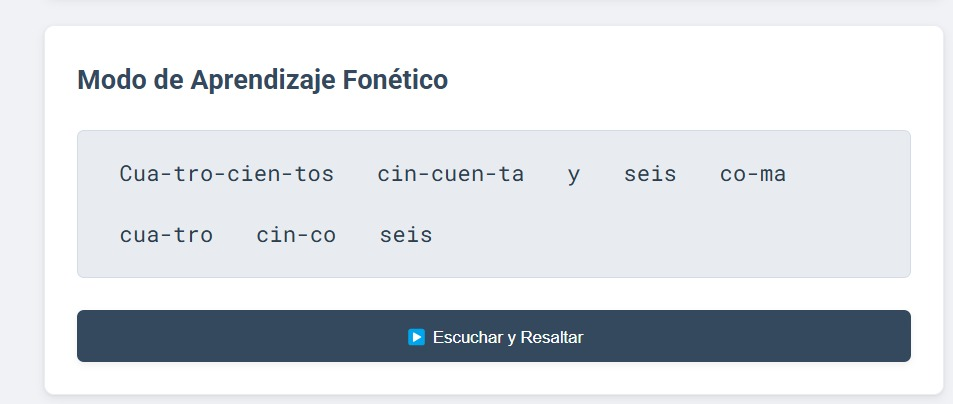
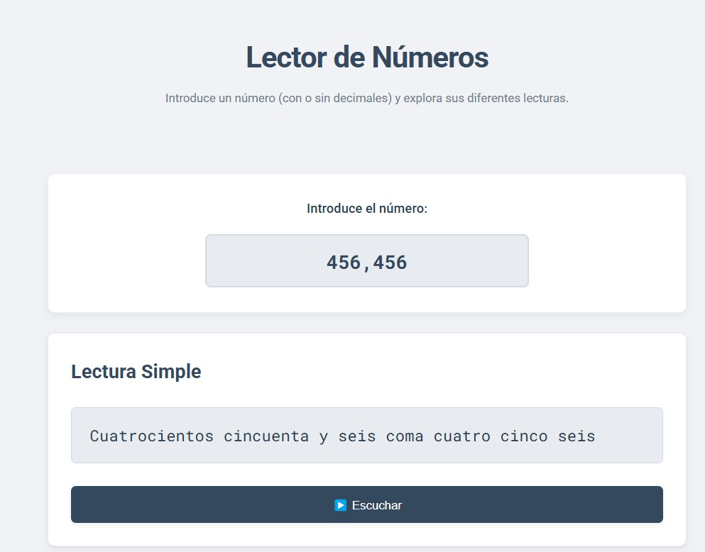
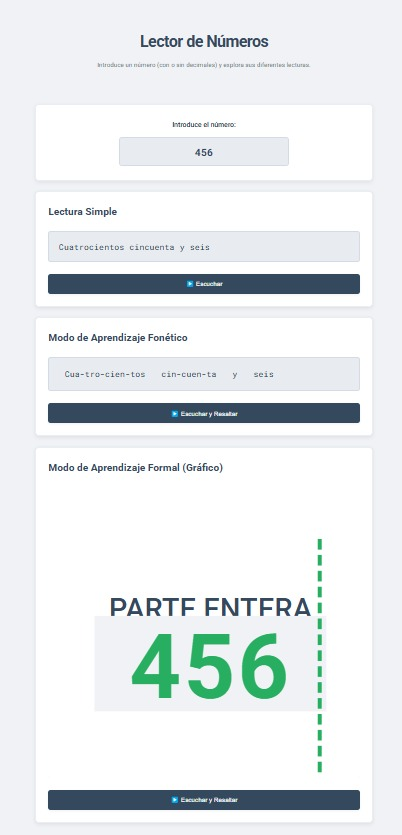
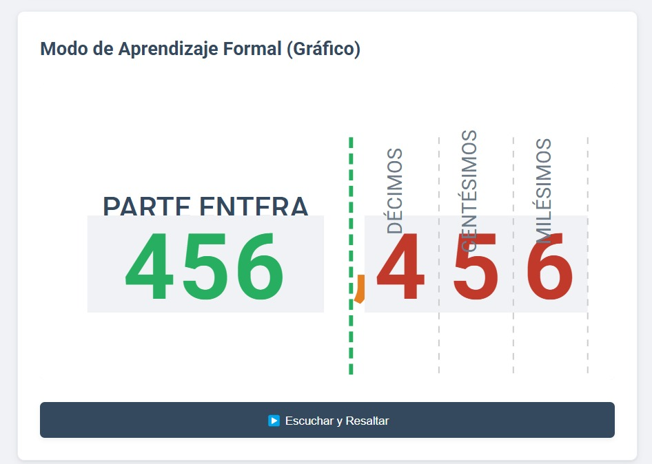

# Lector de Números 🔢

Una herramienta web interactiva diseñada para convertir números (enteros y decimales) a su forma escrita en español, ofreciendo múltiples modos de visualización para facilitar el aprendizaje y la comprensión.



---

## 📖 Sobre el Proyecto

**Lector de Números** es una aplicación web que va más allá de una simple conversión de número a texto. Su objetivo principal es servir como una herramienta educativa que permite a los usuarios no solo leer un número, sino también entender su estructura y pronunciación.

Introduce cualquier número y la aplicación lo desglosará en tres formatos distintos, cada uno pensado para un propósito diferente.

---

## ✨ Características Principales

El proyecto se divide en tres módulos principales para una experiencia de aprendizaje completa:

### 1. Lectura Simple

Ofrece la transcripción directa y más común del número introducido. Ideal para una consulta rápida.



*   **Función**: Convierte el número a texto.
*   **Audio**: Permite escuchar la pronunciación correcta de la lectura completa.

### 2. Modo de Aprendizaje Fonético

Desglosa el número en sílabas o unidades fonéticas, facilitando la correcta pronunciación y ayudando a los usuarios a entender cómo se construyen las palabras que representan cada cifra.



*   **Función**: Separa el texto en fragmentos fonéticos.
*   **Audio Interactivo**: El botón "Escuchar y Resaltar" reproduce el audio mientras resalta la sílaba correspondiente, creando una experiencia de aprendizaje multisensorial.

### 3. Modo de Aprendizaje Formal (Gráfico)

Presenta una representación visual que separa claramente la parte entera de la parte decimal. Cada dígito decimal se ubica bajo su valor posicional correspondiente (décimos, centésimos, milésimos), reforzando la comprensión matemática.



*   **Función**: Muestra gráficamente la estructura del número.
*   **Audio Interactivo**: Al igual que el modo fonético, resalta cada parte del número (entera, coma, decimales) a medida que se reproduce el audio.

---

## 🛠️ Tecnologías Utilizadas

Este proyecto fue construido utilizando tecnologías web estándar, enfocándose en la simplicidad y la accesibilidad.

*   **HTML5**: Para la estructura semántica del contenido.
*   **CSS3**: Para el diseño visual, la responsividad y las animaciones.
*   **JavaScript (ES Modules)**: Para toda la lógica de la aplicación, incluyendo la conversión de números, la manipulación del DOM y la interactividad con la API de Síntesis de Voz del navegador.
*   **Google Fonts**: Para una tipografía limpia y legible (`Roboto` y `Roboto Mono`).

---

## 📁 Estructura del Proyecto

La organización de los archivos es simple y modular, facilitando su mantenimiento y escalabilidad.


---

## 🚀 Cómo Empezar

Para ejecutar este proyecto en tu máquina local, solo sigue estos sencillos pasos:

1.  **Clona el repositorio (si está en GitHub):**
    ```bash
    git clone https://github.com/tu-usuario/lector-de-numeros.git
    ```
2.  **Navega al directorio del proyecto:**
    ```bash
    cd lector-de-numeros
    ```
3.  **Abre el archivo `index.html` en tu navegador.**
    *   Para una mejor experiencia (especialmente por el uso de módulos de JavaScript), se recomienda utilizar un servidor local. Si tienes VS Code, puedes usar la extensión **Live Server**.

¡Y listo! Ya puedes empezar a explorar los números de una manera completamente nueva.